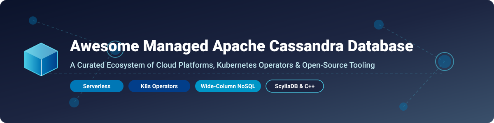

  

# 🚀 Awesome Managed Apache Cassandra Database

  
  
  
  

## 📌 Top Managed Apache Cassandra Database Ecosystem

**Curated List of SaaS Products, Cloud Databases & Open-Source GitHub Projects**  
*Focused on Managed Cassandra, Wide-Column NoSQL & Kubernetes-Native Data Backbones*  

**Last updated: October 2026** 📅

---

This repository tracks notable **commercial managed Cassandra platforms**, **serverless wide-column databases**, and **open-source GitHub projects** that provision, operate, and scale Apache Cassandra-compatible workloads — powering high-throughput workloads, real-time applications, and petabyte-scale data stores without the operational burden of self-managing distributed clusters.

---

## 📑 Table of Contents

- [📈 Market Size & Industry Dynamics](#-market-size--industry-dynamics)
- [☁️ SaaS / Hosted Managed Platforms](#️-saas--hosted-managed-platforms)
- [🛠️ Open-Source GitHub Projects](#️-open-source-github-projects)
- [🤝 How to Contribute](#-how-to-contribute)
- [⚠️ Disclaimer](#️-disclaimer)
- [💖 Support](#-support)
- [⭐ Star History](#-star-history)

---

## 📈 Market Size & Industry Dynamics

> 💡 **Market Size & Structure**: The global operational NoSQL and managed wide-column database market is estimated at **$12.5 Billion+** (2026), growing at **~24% CAGR**. The sector is **moderately fragmented**: dominated at the top by hyper-scaler cloud providers (AWS Keyspaces, Azure Managed Cassandra, Google Cloud Bigtable) while highly performant independent alternatives (DataStax Astra DB, ScyllaDB Cloud, Instaclustr by NetApp) capture high-throughput and multi-cloud enterprise workloads.

---

## ☁️ SaaS / Hosted Managed Platforms

The table below outlines leading commercial managed Cassandra & wide-column SaaS platforms sorted by **Company Size / Valuation (Descending)**:

| Platform 🌐 | Company Size / Valuation 🏢 | Starting Tier Price 💳 | Free Tier / Free Trial Limits 🎁 | Key Features & Notes 📝 |
| :--- | :--- | :--- | :--- | :--- |
| **[Google Cloud Bigtable](https://cloud.google.com/bigtable)** | **~$2.1 Trillion** (Alphabet Inc. MCap) | **~$0.65 / node / hour** (~$475/mo base SSD node + $0.17/GB-mo) | **90-Day Free Trial** (1-node SSD cluster up to 500 GB storage) + **$300 GCP Credits** | Google's fully managed wide-column NoSQL database. Petabyte-scale with HBase API, best for analytical workloads. |
| **[Amazon Keyspaces](https://aws.amazon.com/keyspaces/)** | **~$2.0 Trillion** (Amazon.com Inc. MCap) | **$1.25 / 1M On-Demand WRUs**, **$0.25 / 1M RRUs**, **$0.25 / GB-month** | **3-Month Free Tier**: 30M WRUs, 30M RRUs, and 1 GB storage per month | Serverless Apache Cassandra-compatible database with CQL support, IAM, and auto-scaling. Billed per request. |
| **[Azure Managed Instance for Apache Cassandra](https://azure.microsoft.com/en-us/products/managed-instance-apache-cassandra/)** | **~$3.1 Trillion** (Microsoft Corp. MCap) | **~$3,900 / month** for 6-node equivalent cluster (~$0.90/node-hr) | **30-Day Azure Free Account** ($200 credits for first 30 days) | Real native Apache Cassandra managed control plane in Azure with direct `cassandra.yaml` exposure. |
| **[Instaclustr Managed Cassandra](https://www.instaclustr.com/)** | **~$498 Million** (Acquired by NetApp, ~$28B MCap) | **~$0.18 – $0.40 / node / hour** (~$130–$300/node-mo raw + management markup) | **14-Day Free Trial** (1-node or 3-node small test cluster on GCP/AWS/Azure) | 100% open-source Apache Cassandra managed by NetApp. Proactive 24/7 operations, monitoring & zero lock-in. |
| **[DataStax Astra DB](https://www.datastax.com/products/datastax-astra)** | **~$1.6 Billion** (Private Valuation) | **$0.05 / 100K Read Units**, **$0.15 / 100K Write Units**, **$0.25 / GB-month** | **Free Forever Plan**: $25 monthly recurring credits (~80M reads / 20M writes / 5GB storage) | Multi-cloud serverless Cassandra with native Vector Search for GenAI. Up to 5 free databases. |
| **[ScyllaDB Cloud](https://www.scylladb.com/)** | **~$103M+ Funding** (~$25M+ ARR) | **~$0.45 / node / hour** (Standard tier starting ~$325/mo per node) | **30-Day Developer Free Trial** (1-node cluster) + **48-Hour Benchmark Evaluation** | C++ powered Cassandra-compatible database delivering 10x throughput, sub-millisecond latency & shard-per-core speed. |

---

## 🛠️ Open-Source GitHub Projects

Below are top open-source projects for deploying, operating, and managing Cassandra and wide-column NoSQL databases, sorted by **GitHub Stars (Descending)**:

### 🌟 Core Distributions & Storage Engines

-  **[Apache Cassandra](https://github.com/apache/cassandra)** — The de facto standard open-source distributed wide-column NoSQL database. Linear scalability, multi-datacenter replication, and zero single point of failure.
-  **[ScyllaDB](https://github.com/scylladb/scylladb)** — C++ re-implementation of Apache Cassandra. Shard-per-core architecture, zero GC pauses, delivering up to 10x throughput and lower latency.
-  **[YugabyteDB](https://github.com/yugabyte/yugabyte-db)** — Cloud-native distributed SQL and Cassandra CQL compatible NoSQL database designed for high availability and multi-region resilience.

### ☸️ Kubernetes Operators & Orchestration

-  **[K8ssandra](https://github.com/k8ssandra/k8ssandra)** — Cloud-native distribution of Apache Cassandra on Kubernetes. Bundles repair (Reaper), backup (Medusa), and API gateway (Stargate).
-  **[k8ssandra-operator](https://github.com/k8ssandra/k8ssandra-operator)** — Multi-cluster Kubernetes operator for K8ssandra. Manages multi-region datacenters, automated repairs, and Vector metrics integration.
-  **[cass-operator](https://github.com/k8ssandra/cass-operator)** — DataStax Kubernetes Operator for Apache Cassandra. Automates rack-aware cluster deployment, scaling, and configuration.
-  **[scylla-operator](https://github.com/scylladb/scylla-operator)** — Kubernetes operator for managing ScyllaDB clusters dynamically on K8s.

### 🔧 Operational Tooling, APIs & Sidecars

-  **[Stargate](https://github.com/stargate/stargate)** — Open-source data gateway for Apache Cassandra providing REST, GraphQL, gRPC, and Document APIs.
-  **[Cassandra Reaper](https://github.com/thelastpickle/cassandra-reaper)** — Automated repair management tool for Apache Cassandra, scheduling anti-entropy repairs across clusters.
-  **[Medusa](https://github.com/thelastpickle/cassandra-medusa)** — Backup and restore automation tool for Apache Cassandra supporting AWS S3, Google Cloud Storage, and Azure Blob.
-  **[NoSQLBench](https://github.com/nosqlbench/nosqlbench)** — Scriptable benchmarking tool designed specifically for testing Cassandra, ScyllaDB, and NoSQL databases under real workload stress.
-  **[Management API for Apache Cassandra](https://github.com/k8ssandra/management-api-for-apache-cassandra)** — RESTful secure management sidecar layer replacing JMX for lifecycle, health check, and operational actions.
-  **[cassandra-exporter](https://github.com/criteo/cassandra-exporter)** — Export Apache Cassandra metrics directly to Prometheus via standalone Java agent.

---

## 🤝 How to Contribute

1. Fork this repository 🍴
2. Add or update entries in `README.md` following the tabular or badge format.
3. Ensure entries are relevant to **Managed Cassandra**, wide-column NoSQL, or ecosystem tooling.
4. Submit a Pull Request 📥 with a clear summary of changes.

---

## ⚠️ Disclaimer

- This repository is a community-curated list and does not constitute formal endorsement.
- **Aiven for Apache Cassandra** reached End-of-Life (EOL) in January 2026 and is excluded from active recommendations.
- Always verify cloud cost models before scaling large production clusters.

---

## 💖 Support

If you found this list helpful, please consider supporting the project:

- ⭐ **Star** this repository to increase visibility.
- 🔀 **Fork** and contribute new tools or pricing updates.
- 📢 **Share** with data engineering and DevOps teams.
- ☕ **Sponsor** the developer via [GitHub Sponsors](https://github.com/sponsors/ishandutta2007).

---

## 📊 Star History

